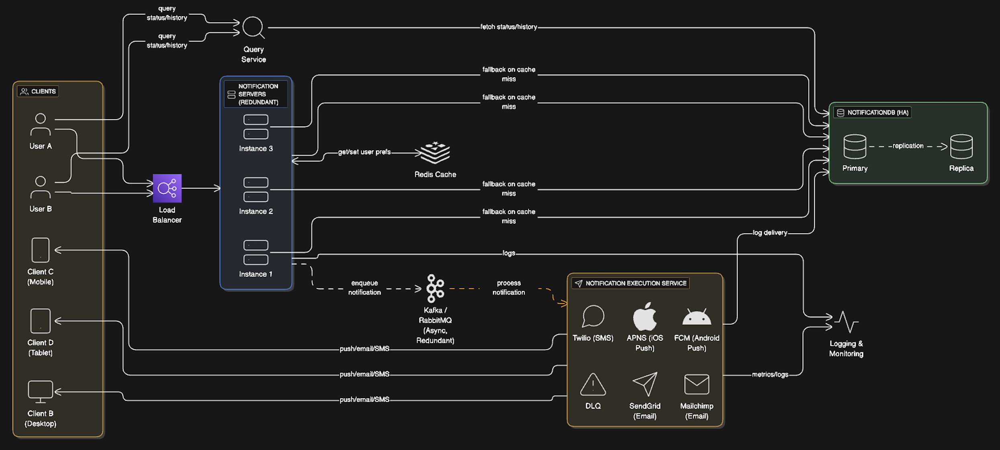

# Notification System — Architecture & Design Documentation

## Table of Contents
1. [Overview](#overview)  
2. [High-Level Design (HLD)](#high-level-design-hld)  
   - [Functional Requirements](#functional-requirements)
   - [Non-Functional Requirements](#non-functional-requirements)
   - [Capacity Estimation and Constraints](#capacity-estimation-and-constraints)
   - [System APIs](#system-apis)
   - [Database Schema](#database-schema)
   - [Workflow](#workflow)
   - [Optimizations](#optimizations)
   - [Rate Limiting and Retry Mechanism](#rate-limiting-and-retry-mechanism)
3. [Low-Level Design (LLD)](#low-level-design-lld)
   - [Class Diagram](#class-diagram)
   - [Design Patterns Used](#design-patterns-used)
   - [Component Interactions](#component-interactions)
   - [Output](#output)

---

## Overview
This project implements a scalable, modular, and fault-tolerant **Notification System** that supports multiple delivery channels (Push, SMS, Email, and In-App).  
It emphasizes performance, reliability, extensibility, and maintainability through robust architectural design and the use of appropriate design patterns.

---

## High-Level Design (HLD)

### HLD Diagram


---

### Functional Requirements
- **Event Detection:** Capture and process system events that trigger notifications (e.g., messages, alerts, updates).
- **Notification Types:** Support multiple channels — push, email, SMS, in-app.
- **Notification Handling:** Efficiently manage both single and bulk notifications.
- **Searching Feature:** Enable users to search and query past notifications efficiently.
- **Delivery Preferences:** Allow users to customize delivery methods and timing preferences.

---

### Non-Functional Requirements
- **High Availability:** Ensure uninterrupted notification delivery via redundant services.
- **Low Latency:** Deliver notifications within 200ms under normal load.
- **Scalability:** Handle large notification volumes without degradation.
- **Reliability:** Guarantee message persistence and retry mechanisms for failed deliveries.

---

### Capacity Estimation and Constraints
**Assumptions:**
- 1M daily active users (DAU)
- Average 10 notifications per user/day  
→ **10M notifications/day**

**Storage Requirement:**
- Each notification ≈ 200 bytes  
→ 10M × 200 bytes = **2 GB/day**  
→ 1-month retention ≈ **60 GB**

**Bandwidth:**
- Each request/response ≈ 1 KB  
→ (10M × 1 KB) / 86400 ≈ **116 KB/s (inbound and outbound)**

---

### System APIs

#### Fetch User Data
`GET /FetchUserData`
```json
{
  "id": "6767",
  "name": "Sayan Singh",
  "notificationPreferences": {
    "email": true,
    "push": false
  }
}
```
`GET /FetchNotification`
```json
  {
  "notifications": [
    {
      "id": "notif567",
      "type": "post_liked",
      "message": "abc liked your post",
      "timestamp": "2025-10-12T12:00:00Z"
    }
  }
}
```
`POST /QueryNotifications`
```json
{
  "notifications": [
    {
      "id": "notif567",
      "type": "shipment",
      "message": "Your order has been shipped",
      "timestamp": "2025-10-12T15:00:00Z",
      "readStatus": "read"
    }
  ]
}
```
`POST /SendNotification`
```json
{
  "status": "success",
  "message": "Notification sent successfully."
}
```

## Database Schema

| **Table** | **Description** |
|------------|----------------|
| **Users** | Stores user info and notification preferences |
| **Notifications** | Logs notification details (type, content, timestamps, status) |
| **Notification Logs** | Records delivery actions and errors |
| **Event Detection** | Captures events that trigger notifications |

---

## Workflow

1. **Clients (Users/Devices)** send requests for notifications or queries.  
2. **Load Balancer** routes traffic to redundant **Notification Servers**.  
3. **Notification Servers** fetch user preferences (via **Redis cache** for speed).  
4. Notifications are **queued** using **Kafka/RabbitMQ** for asynchronous processing.  
5. **Notification Executor** processes and sends notifications via:  
   - **Twilio (SMS)**  
   - **APNS (iOS)**  
   - **FCM (Android)**  
   - **SendGrid/Mailchimp (Email)**  
6. **Logs and metrics** are stored for monitoring and analytics (via **Prometheus**, **Grafana**, **Sentry**).

---

## Optimizations

### **Reduce Database Delays**
- Implement **Redis cache** for user preferences and frequently queried data.  
- Achieve up to **90% reduction in data access latency**.

### **Avoid Single Points of Failure (SPOF)**
- Use **Load Balancers** and multiple **Notification Server instances**.  
- Employ **DB replication (Primary → Replica)** for redundancy and fault tolerance.

### **Manage Diverse Notification Types**
- Integrate external providers like **APNS**, **FCM**, **Twilio**, and **SendGrid** for channel-specific delivery.

### **Handle Heavy Loads**
- Employ **message queues (Kafka/RabbitMQ)** and **background workers** for asynchronous processing, ensuring scalability and system responsiveness.

---

## Rate Limiting and Retry Mechanism

### **Rate Limiting**
- Prevents flooding users with excessive notifications.  
- Ensures smooth traffic flow and prevents overload during peak periods.

### **Retry Mechanism**
- Failed notifications are **retried using exponential backoff** until successful or until retry limits are reached.  
- **Persistent failures** are logged and monitored for further investigation.

---

## Low-Level Design (LLD)

### **Class Diagram**


---

### **Design Patterns Used**

| **Pattern** | **Purpose** |
|--------------|-------------|
| **Observer Pattern** | Manages event-driven notification updates between subjects and observers |
| **Strategy Pattern** | Allows switching between delivery strategies (Email, SMS, Push) dynamically |
| **Decorator Pattern** | Adds metadata (timestamps, signatures) to notifications without altering base logic |
| **Singleton Pattern** | Ensures centralized management of services like logging or configuration |
| **Factory Method (implicit)** | Handles creation of different notification objects based on type |

---

### **Component Interactions**

- **INotification** → Base interface for all notifications.  
- **SimpleNotification** → Core notification message.  
- **INotificationDecorator** → Base decorator class.  
  - **TimestampDecorator** / **SignatureDecorator** → Extend notification metadata.  
- **NotificationObservable** → Maintains a list of observers.  
- **IObserver** → Interface for observers (e.g., **Logger**, **Engine**).  
- **NotificationEngine** → Central orchestrator connecting strategies, observers, and decorators.  
- **Strategies:**  
  - `EmailStrategy`  
  - `SMSStrategy`  
  - `PopupStrategy`  
- **Logger** → Captures logs for each notification and observer interaction.

---

### **Modular Design Advantage**
- This modular interaction ensures **easy extensibility** — new notification channels or decorators can be added without modifying existing code, supporting maintainability and scalability of the system.
---
### **Output**

